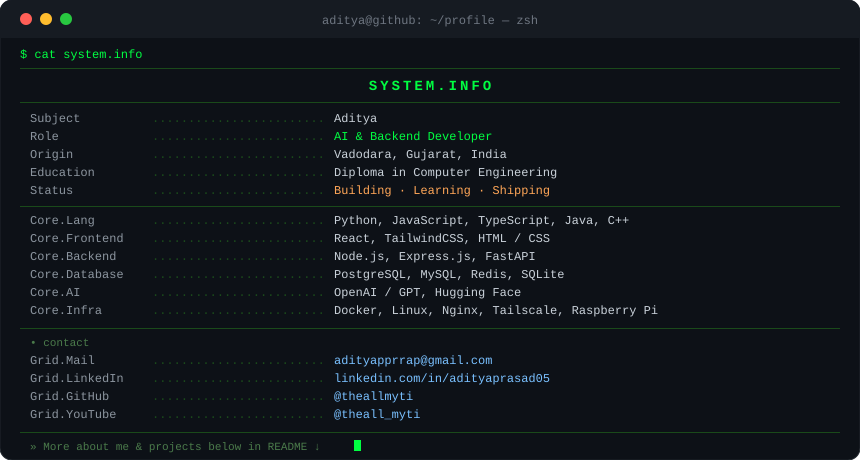

<!-- Animated Typing Header -->

 

<!-- Terminal Info Panel -->

  

 

 

<!-- Contribution Snake -->

  <picture>
    <source media="(prefers-color-scheme: dark)" srcset="https://raw.githubusercontent.com/theallmyti/theallmyti/output/github-contribution-grid-snake-dark.svg">
    <source media="(prefers-color-scheme: light)" srcset="https://raw.githubusercontent.com/theallmyti/theallmyti/output/github-contribution-grid-snake.svg">
    
  </picture>

 

---

## 🗂️ PROJECTS.LIST

| 🚀 Project | 📝 Description | 🛠️ Tech |
|:-----------|:--------------|:--------|
| [**Mirachi**](https://github.com/theallmyti/mirachi) | AI ecosystem for intelligent assistants, automation & self-hosted AI tools |    |
| [**Odysseus**](https://github.com/theallmyti/odysseus) | Self-hosted AI assistant powered by NVIDIA NIM with streaming chat & tool execution |    |
| [**Home Server**](https://github.com/theallmyti/home-server) | Personal cloud — Jellyfin, Immich, ARR stack & remote services on Raspberry Pi |    |
| [**ISL Assistant**](https://github.com/theallmyti/isl-translator) | SIH project enabling real-time communication via Indian Sign Language |   |
| [**Dashboard**](https://github.com/theallmyti/dashboard) | Modern Docker monitoring dashboard with telemetry, service status & analytics |    |
| [**MICS**](https://github.com/theallmyti/mics) | Self-hosted music backend with metadata, streaming utilities & automation |   |

---

## ⚔️ TECH ARSENAL

<table>
  <tr>
    <td align="center" width="33%">

**LANGUAGES & FRAMEWORKS**

  </td>
  <td align="center" width="34%">

**AI & MACHINE LEARNING**

  </td>
  <td align="center" width="33%">

**BACKEND & DATABASE**

  </td>
  </tr>
  <tr>
    <td align="center" colspan="3">

**TOOLS & PLATFORMS**

&nbsp;

  </td>
  </tr>
</table>

---

## 🔗 CONNECT

&nbsp;

&nbsp;

&nbsp;

&nbsp;

&nbsp;

---

&nbsp;

&nbsp;

